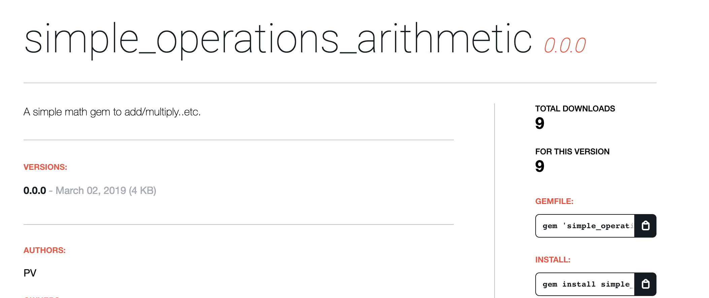

## Gem creation 

Creating a gem for learning purposes (screenshot below) 



Following the instructions detailed [here](https://guides.rubygems.org/make-your-own-gem/)

## Getting Started

Since it is a gem you can require it through terminal : 

```
gem install simple_operations_arithmetic
```

then install the dependency : 

```
bundle install
``` 


## Using it 

Once installed, you can use the add method to add up two numbers (very basic to start with): 

In terminal you can use irb to test the gem : 

``` 
irb
require 'simple_operations_arithmetic'
>> Arithmetic.add(1,2)
3

```


